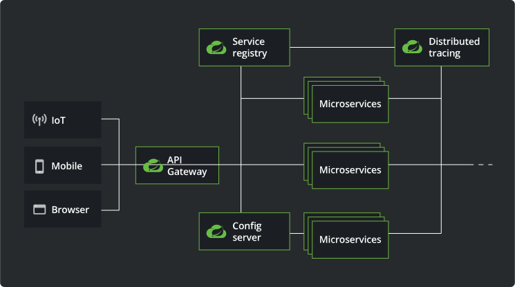

# 유레카 서버 (Eureka Server)

# Spring Cloud 아키텍처 관계도

출처 : https://spring.io/cloud

# Eureka 란? ( ChatGPT )
- Eureka 는 Netflix 에서 개발한 오픈 소스 기반의 서비스 디스커버리 서버입니다. 이는 분산 시스템에서 서비스 인스턴스의 위치를 추적하고 관리하는 데 사용됩니다.  
  주요 기능은 다음과 같습니다:
  - 서비스 등록 및 검색 : Eureka 는 서비스 인스턴스가 등록되면 자동으로 검색 가능하게 만들어줍니다.  
    따라서 클라이언트 애플리케이션은 Eureka 서버에 등록된 서비스의 인스턴스를 찾을 수 있습니다.
  - 가용성과 장애 복구 : Eureka 는 서비스 인스턴스의 상태를 지속적으로 모니터링하고, 일시적인 장애 또는 다운된 인스턴스를 감지하면 해당 인스턴스를 제외시킵니다.  
    이렇게 함으로써 시스템의 가용성을 향상시키고 장애 복구를 용이하게 합니다.
  - 클라우드 네이티브 지원 : Eureka 는 클라우드 네이티브 환경에서의 사용을 고려하여 설계되었습니다.  
    즉, 동적인 환경에서 서비스 인스턴스를 쉽게 관리할 수 있습니다.
  - 강력한 확장성 : Eureka 는 대규모 시스템에서도 잘 확장될 수 있는 구조로 설계되었습니다.  
    따라서 시스템의 크기가 커져도 성능과 확장성을 유지할 수 있습니다.
- Eureka 는 Spring Cloud 에서 기본적으로 제공되는 서비스 디스커버리 솔루션 중 하나이며, Spring 애플리케이션과의 통합이 용이합니다.  
  이를 통해 개발자는 간편하게 마이크로서비스 아키텍처를 구축하고 운영할 수 있습니다.

- Eureka 는 Eureka Server 와 Eureka Client 로 구성된다.
- MSA 아키텍처에서 client-side service discovery 역할을 한다.
  - 컨테이너 pod 는 언제든 꺼졌다가 켜졌다가 할 수 있으므로 host 와 port 가 동적으로 변하더라도 서비스 인스턴스를 관리할 수 있어야 한다.
  - 이를 도와주는 것이 Spring Cloud 의 Eureka Server 인 것이다.
- Eureka 는 middle-tier load balancer 로 정의된다.
  - middle-tier load balancer 는 로드밸런싱과 장애복구가 가능한 서비스 환경을 구성했을 때 클라이언트에게 사용 가능한 서비스의 위치 정보를 동적으로 제공해야한다.
  - 마이크로서비스들의 정보를 레지스트리에 등록할 수 있도록 하고 마이크로서비스의 동적인 탐색과 로드밸런싱을 제공한다.
  - 클라우드 환경에서는 서버의 위치가 동적으로 변하고 있기에 더욱 주목받는 기술이다.
- Eureka Client 의 서비스가 시작 될 때 Eureka Server 에 자신의 정보를 등록한다.
  - 등록된 후에는 30초마다 레지스트리에 ping 을 전송하여 자신이 가용 상태임을 알리는데 일정 횟수 이상 ping 이 확인되지 않으면 Eureka Server 에서 해당 서비스를 레지스트리에서 제외시킨다.
- 레지스트리의 정보는 모든 Eureka Client 에 복제되어 있어 필요할 때마다 가용 상태인 모든 서비스들의 목록을 확인할 수 있고 이 목록은 30초마다 갱신된다.
  - 가용 상태의 서비스 목록을 확인할 경우에는 서비스의 이름을 기준으로 탐색하며 로드밸런싱을 위해 내부적으로 Ribbon(클라이언트 측의 로드밸런서)을 사용한다.

## 개발환경
- JDK : Zulu JDK 17.0.10
- SpringBoot : 3.2.3 
  - `implementation 'org.springframework.cloud:spring-cloud-starter-netflix-eureka-server`
  - dependency 에 포함되어 있다.
- SpringBoot Eureka Server : 현재 최신버전 4.1.0
- build tools : Gradle

## Spring Cloud 버전과 Spring Boot 버전 및 JDK 의 버전 호환성
- 출처
```text
https://spring.io/projects/spring-cloud#overview  
https://github.com/spring-projects/spring-framework/wiki/Spring-Framework-Versions
```
| Release Train        | Spring Boot Generation                | JDK 버전 ( LTS ) | 비고   |
|----------------------|---------------------------------------|----------------|------|
| 2023.0.x aka Leyton  | 3.2.x                                 | JDK 17         |      |
| 2022.0.x aka Kilburn | 3.0.x, 3.1.x (Starting with 2022.0.3) | JDK 17         |      |
| 2021.0.x aka Jubilee | 2.6.x, 2.7.x (Starting with 2021.0.3) | JDK 11         |      |
| 2020.0.x aka Ilford  | 2.4.x, 2.5.x (Starting with 2020.0.3) | JDK 11         |      |
| Hoxton               | 2.2.x, 2.3.x (Starting with SR5)      | JDK 8, 11      |      |
| Greenwich            | 2.1.x                                 | JDK 8          | 지원종료 |
| Finchley             | 2.0.x                                 | JDK 8          | 지원종료 |
| Edgware              | 1.5.x                                 | JDK 6, 7, 8    | 지원종료 |
| Dalston              | 1.5.x                                 | JDK 6, 7, 8    | 지원종료 |

## Source
- 유레카 서버(Erureka Server)의 개발은 간단하다.
- 기본적으로 3개의 파일만 필요하다.
  - `build.gradle`, `EurekaServerApplication.java`,`application.yml`

#### build.gradle
```gradle
plugins {
  id 'java'
  id 'org.springframework.boot' version '3.2.3'
  id 'io.spring.dependency-management' version '1.1.4'
}

group = 'octopus'
version = '0.0.1-SNAPSHOT'

java {
  sourceCompatibility = '17'
}

repositories {
  mavenCentral()
}

  ext {
  set('springCloudVersion', "2023.0.0")
}

dependencies {
  implementation 'org.springframework.cloud:spring-cloud-starter-netflix-eureka-server'
  testImplementation 'org.springframework.boot:spring-boot-starter-test'
}

dependencyManagement {
  imports {
    mavenBom "org.springframework.cloud:spring-cloud-dependencies:${springCloudVersion}"
  }
}

tasks.named('test') {
  useJUnitPlatform()
}
```

#### EurekaServerApplication.java
```java
import org.springframework.boot.SpringApplication;
import org.springframework.boot.autoconfigure.SpringBootApplication;
import org.springframework.cloud.netflix.eureka.server.EnableEurekaServer;

@SpringBootApplication
@EnableEurekaServer               // 스프링 서비스에서 유레카 서버 활성화
public class EurekaServerApplication {

  public static void main(String[] args) {

    SpringApplication.run(EurekaServerApplication.class, args);
  }

}
```

#### application.yml
```yml
# 유레카 서버 Port
server:
port: 8761

spring:
application:
name: discovery-service

# eureka 설정
eureka:
client:
register-with-eureka: false     # eureka server에 자신을 등록하지 않음. registry에 등록할지 여부. false로 하지 않으면 자기 자신을 클라이언트로 등록함
fetch-registry: false           # 레지스트리 정보를 로컬에 캐싱하지 않음. registry에 있는 정보들을 가져올지 여부
```

## Build
#### 프로젝트 디렉토리에서 실행한다.
```text
$ ./gradlew bootJar
```

## 실행
#### 파일 찾기
```text
$ find . -name '*.jar'                                   
./gradle/wrapper/gradle-wrapper.jar
./build/libs/EurekaServer-0.0.1-SNAPSHOT.jar
```

#### jar 실행
- [프로젝트 디렉토리]/build/libs 폴더에 Build 됨. 
- `java -jar EurekaServer-0.0.1-SNAPSHOT.jar `
```text
# java -jar ./workspace/EurekaServer/build/libs/EurekaServer-0.0.1-SNAPSHOT.jar
# java -jar EurekaServer-0.0.1-SNAPSHOT.jar                               

  .   ____          _            __ _ _
 /\\ / ___'_ __ _ _(_)_ __  __ _ \ \ \ \
( ( )\___ | '_ | '_| | '_ \/ _` | \ \ \ \
 \\/  ___)| |_)| | | | | || (_| |  ) ) ) )
  '  |____| .__|_| |_|_| |_\__, | / / / /
 =========|_|==============|___/=/_/_/_/
 :: Spring Boot ::                (v3.2.3)
```

## 관리 URL
`http://localhost:8761`

## Git Push
```git
git init
git add README.md
git commit -m "first commit"
git branch -M main
git remote add origin https://github.com/hermeswing/EureakServer.git
git push -u origin main
```

## 오류
```text
Execution failed for task ':compileJava'.
> Could not resolve all files for configuration ':compileClasspath'.
   > Could not resolve org.springframework.boot:spring-boot-starter:3.2.0.
     Required by:
         project : > org.springframework.cloud:spring-cloud-starter-netflix-eureka-server:4.1.0 > org.springframework.cloud:spring-cloud-starter:4.1.0
      > No matching variant of org.springframework.boot:spring-boot-starter:3.2.3 was found. The consumer was configured to find a library for use during compile-time, compatible with Java 11, preferably in the form of class files, preferably optimized for standard JVMs, and its dependencies declared externally but:
          - Variant 'apiElements' capability org.springframework.boot:spring-boot-starter:3.2.3 declares a library for use during compile-time, packaged as a jar, and its dependencies declared externally:
              - Incompatible because this component declares a component, compatible with Java 17 and the consumer needed a component, compatible with Java 11
              - Other compatible attribute:
                  - Doesn't say anything about its target Java environment (preferred optimized for standard JVMs)
          - Variant 'javadocElements' capability org.springframework.boot:spring-boot-starter:3.2.3 declares a component for use during runtime, and its dependencies declared externally:
              - Incompatible because this component declares documentation and the consumer needed a library
              - Other compatible attributes:
                  - Doesn't say anything about its target Java environment (preferred optimized for standard JVMs)
                  - Doesn't say anything about its target Java version (required compatibility with Java 11)
                  - Doesn't say anything about its elements (required them preferably in the form of class files)
```
- 기본적올 Springboot 3.x는 11버전 이상이어야 함.
- JVM Version을 올려서 해결하였음. -> Zulu JDK 17.0.10

#### 대부분 JVM Version 문제로 발생된 문제였음.
- 차후 JDK 11 버전으로 개발 해봐야 겠음. 아마도 SpringBoot 2.x 버전으로 다운그래드 할 듯...

## 참고 URL
> Spring Cloud Netflix : https://cloud.spring.io/spring-cloud-netflix/reference/html/  
> Eureka self-preservation : https://subji.github.io/posts/2020/08/11/springcloudeurekaregistry  
> Eureka self-preservation : https://dzone.com/articles/the-mystery-of-eurekas-self-preservation  
> Eureka 설정 : https://coe.gitbook.io/guide/service-discovery/eureka  
> Eureka 설정 : https://coe.gitbook.io/guide/service-discovery/eureka_2  
> Eureka 설정 : https://velog.io/@ililil9482/series/jayeon  
> Spring Cloud 구축 : https://sjh9708.tistory.com/120  
> API Gateway in Spring boot : https://medium.com/@ankithahjpgowda/api-gateway-in-spring-boot-3ea804003021 ( https://medium.com/@ankithahjpgowda )
> 